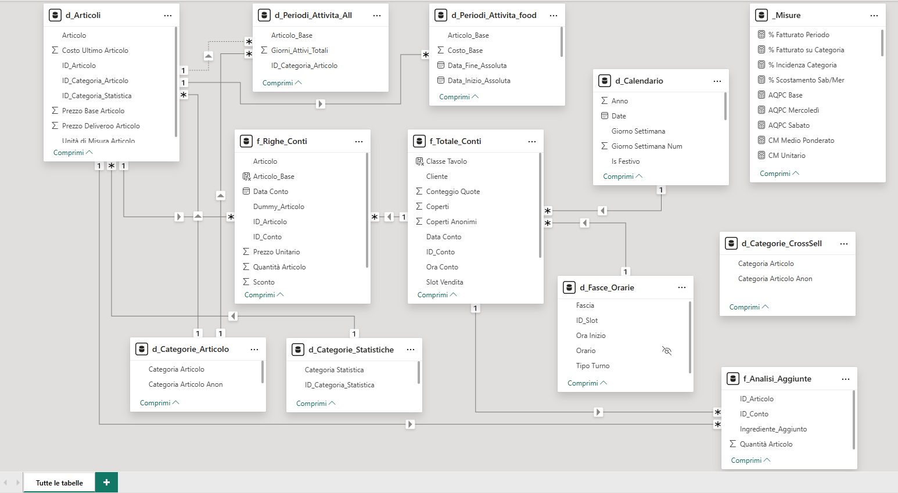

# Strategic Business Intelligence & Advanced Analytics | Eccellenza Ho.Re.Ca.

## 📌 Panoramica del Progetto
Consulenza di Business Intelligence e Advanced Analytics prestata per una storica attività ristorativa di alto livello, riconosciuta dalle principali guide di settore come **Gambero Rosso** e **50 Top Pizza**. Il progetto ha trasformato dati transazionali complessi in una struttura decisionale solida e scalabile, orientando la direzione verso una gestione interamente **Data-Driven**.

---

## 🛠️ Fase 1: Data Governance & ERP Integration
In questa fase preliminare, l'obiettivo è stato l'efficientamento dell'infrastruttura dati alla fonte:
* **Integrazione ERP**: Intervento diretto sul sistema gestionale aziendale per assicurare coerenza, integrità e normalizzazione del dato prima delle fasi di estrazione.
* **Automazione dei Costi**: Implementazione di flussi automatizzati per il calcolo dei costi di produzione tramite l'integrazione delle fatture elettroniche e la creazione dei processi produttivi dettagliati.
* **Data Validation**: Creazione di una base dati validata per il monitoraggio dei margini operativi in tempo reale.

---

## 📊 Fase 2: Data Analysis & Strategic Insights
Analisi multidimensionale condotta su oltre **2,5 anni di storico transazionale** per decodificare i driver di crescita e redditività.

### 🏗️ Architettura Tecnica
Sviluppo di una pipeline **ETL** e costruzione di un modello semantico in **Power BI** basato su un **Galaxy Schema** (Fact Constellation) con struttura a diamante. Questa architettura è stata ottimizzata per gestire relazioni complesse tra flussi di vendita, anagrafica articoli e dimensioni temporali.

*Visualizzazione dell'architettura semantica del progetto.*

### 📖 Metodologia di Dominio
Il progetto ha integrato framework specialistici internazionali per garantire rigore analitico:
* **Menu Engineering**: Applicazione del framework di **Smith & Kasavana** per la classificazione dell'offerta (Stars, Plowhorses, Puzzles, Dogs).
* **Market Basket Analysis (MBA)**: Utilizzo di metriche di **Lift, Confidence e Attachment Rate** per mappare le adiacenze di acquisto.
* **Framework USAR & Revenue Management**: Uniform System of Accounts for Restaurants per la standardizzazione della reportistica finanziaria.

### 💡 Insight Strategici & Ottimizzazione
* **Dinamiche Controintuitive**: Individuazione di dinamiche controintuitive nella relazione tra flussi di affluenza e spesa pro-capite, mappando opportunità operative a parità di costo.
* **Strategie di Vendita**: Implementazione di tecniche di upselling e cross-selling a basso impatto operativo, basate sui risultati analitici della MBA.
* **Impatto sul Business**: Definizione di una **Roadmap Operativa** per l'ottimizzazione della redditività globale, includendo la revisione chirurgica dei prezzi per gli outlier di costo e una ristrutturazione scientifica dell'offerta basata sulla popolarità reale e sui margini di contribuzione.

---

## 📁 Contenuti della Repository
* `Modello_Semantico_Galaxy_Schema.png`: Screenshot dettagliato dell'architettura del dato.
* `Report_Power_BI_anonimizzato.pdf`: Estratto delle dashboard interattive di analisi.
* `Indice_Report_Analisi.pdf`: Struttura e indice metodologico della consulenza prodotta.

---
*Note: Per ragioni di riservatezza e conformità GDPR, i nomi dei clienti e i dati sensibili sono stati anonimizzati o alterati.*
